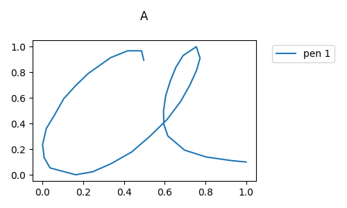
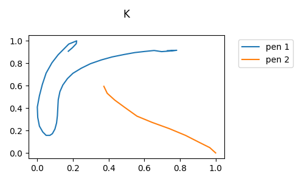

Images of UJI Pen Characters Dataset
=====

  

    
    
  

  
Sample view of UJI Pen Characters. The left figure uses only one pen stroke and the right one uses two pen strokes.

## Reference
[1] Dua, D. and Graff, C. (2019). UCI Machine Learning Repository [http://archive.ics.uci.edu/ml]. Irvine, CA: University of California, School of Information and Computer Science.
